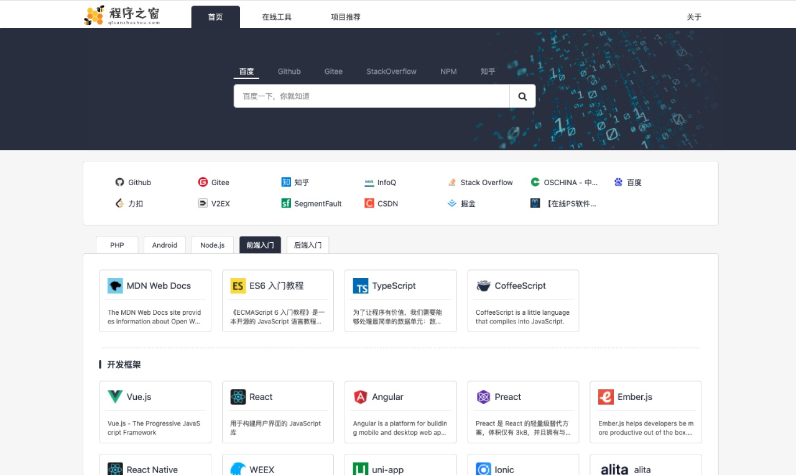
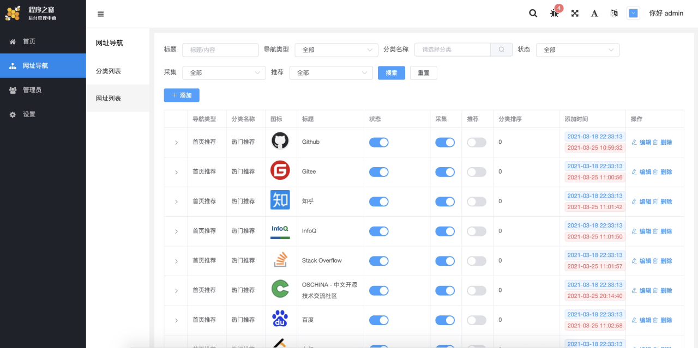
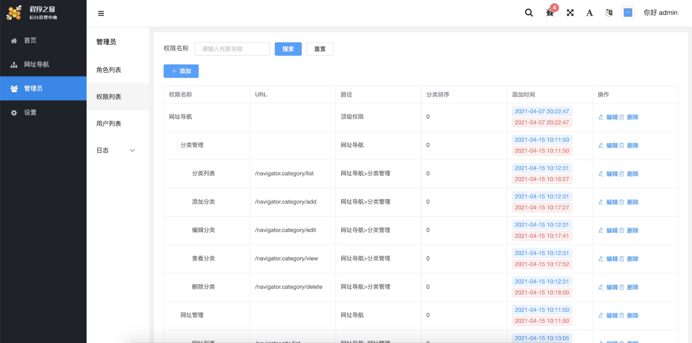
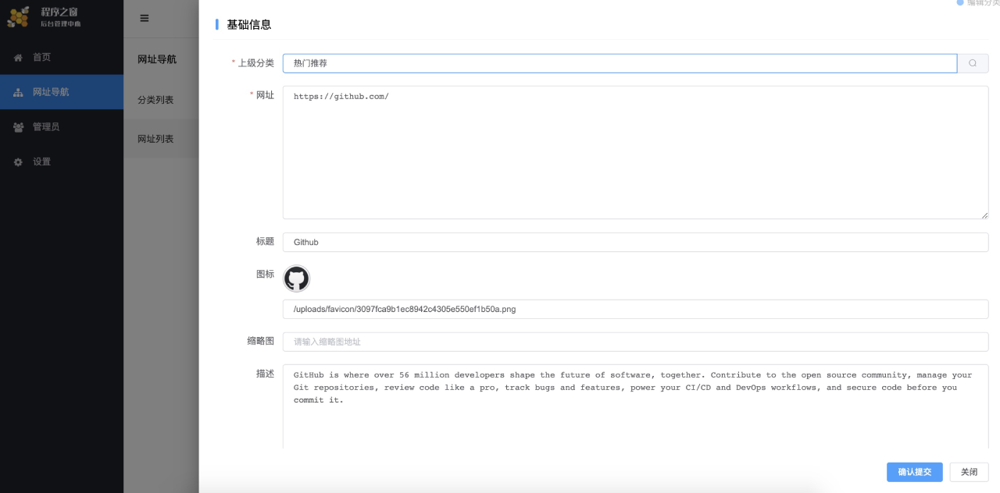

# 程序之窗

一个开源的网址导航网站项目，具备完整的前后台，您可以拿来制作自己的网址导航。
THINKPHP6 + Vue + ElementUI，支持JWT登录，RBAC，一键CRUD。

### 演示地址
[点击这里](https://www.qisanzhushou.com)

### SPA源码
联系QQ：442958506

### 部署

克隆代码：

```shell
git clone https://github.com/eaglering/qisanzhushou-api.git
```

安装依赖：

```shell
$ composer install
```

编辑配置：

```
$ cp .example.env .env
```

```
...
HOSTNAME = 127.0.0.1
DATABASE = test
USERNAME = username
PASSWORD = password
PREFIX = prefix_
...
```

生成 KEY：

```shell
$ php think jwt:create 
```

迁移数据：

```shell
php think migrate:run
```

备份数据库
```shell
php think migrate:generate
```

生成mvc代码
```shell
php think make:mvc [-t [table]|-a]
```


采集站点信息
```shell
php think navigator.site:capture
```

本地测试：

```shell
$ php think run
```

安装完成：http://127.0.0.1:8000



---
### 管理后台

后台地址：http://127.0.0.1:8000/backend

默认用户：admin

默认密码：admin123







## License

MIT

## 捐赠

如果你觉得该项目对你有帮助，可以对我进行捐赠。


